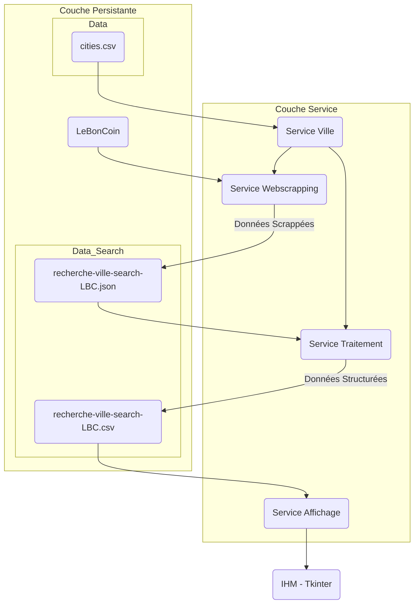

# LBC-Analyzer


<!-- DESCRIPTION -->
## Description
Permet d'analyser de dénicher de bonnes offres sur LeBonCoin.


<!-- GETTING STARTED -->
## Getting Started

### Prerequisites

- Python


### Installation

1. Clone the repo
   ```bash
   git clone https://github.com/Max32x/LBC-Analyzer
   ```

2. Install all the necessary libraries

   ```bash
   pip install -r requirements.txt
   ```
   
3. Execute the script

   ```sh
   python "main.py" 
   ```


<!-- USAGE EXAMPLES -->
## Usage
Le but de ce prgoramme est de repérer de bonnes offres à l'aide d'outil statistiques.


On définit un terme de recherche, et un localisation. Le logiciel s'occupe de repertoirer toute les aannonces correspondantes et faire une regression.
Il n'y a plus qu'à selectionner les points les plus eloignés de la droite de regression


<!-- ROADMAP -->
## Roadmap

- [x] Create Services 
- [X] Create Tkinter Interface
- [X] Link Interface to services
- [ ] Make an interractive output (hard) 
- [ ] Add Docker ?
- [ ] Add pipelines ?


<p align="right">(<a href="#readme-top">back to top</a>)</p>


<!-- Diagram -->
## Diagram of Architecture




## Project status
The project is still in developpment;


## Authors and acknowledgment

Developped by Maxime TIO, under the supervision of rag(o)atzino


<!-- LICENSE -->
## License

Distributed under the MIT License.

<p align="right">(<a href="#readme-top">back to top</a>)</p>


