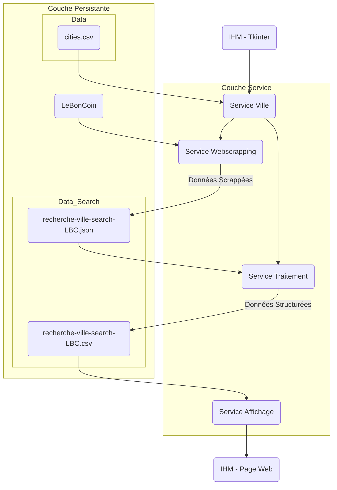

# LBC-Analyzer


<!-- DESCRIPTION -->
## Description
Le but de ce programme est de repérer de bonnes offres sur LeBonCoin à l'aide d'outils statistiques.

On définit un terme de recherche, et une localisation. Le logiciel s'occupe de repertoirer toutes les annonces correspondantes et faire une regression sur ces données.
Les points les plus éloignées de la droite de regression sont les bonnes affaires.

On regresse :
- le prix sur le kilometrage lorsqu'il s'agit d'un véhicule
- le prix sur la surface habitable lorsqu'il s'agit d'un logement
- le prix sur la date de publication sinon


### Known Issues

- Parfois la regression biaisée à cause de données non correspondante au mot clé 


<!-- GETTING STARTED -->
## Getting Started

### Prerequisites

- Python


### Installation

   ```bash
   git clone https://github.com/Max32x/LBC-Analyzer
   cd LBC-Analyzer
   pip install -r requirements.txt
   python "main.py" 
   ```


<!-- USAGE EXAMPLES -->
## Usage

- Renseigner un terme de recherche
- Renseigner une ville
- Choisir une categorie, laisser 'aucune' sinon
- Choisir un rayon de recherche
- Admirer le travail

<!-- ROADMAP -->
## Roadmap

- [x] Create Services 
- [X] Create Tkinter Interface
- [X] Link Interface to services
- [ ] Make an interractive output (hard) 
- [X] Add filter
- [X] <del>Test with Mocker</del>
- [X] <del>Add Docker ?</del>
- [X] Create an executable.
- [X] Add pipelines to create executable


<p align="right">(<a href="#readme-top">back to top</a>)</p>


<!-- Diagram -->
## Diagram of Architecture




## Project status
The project is still in developpment;


## Authors and acknowledgment

Developped by Maxime TIO, under the supervision of rag(o)atzino


<!-- LICENSE -->
## License

Distributed under the MIT License.

<p align="right">(<a href="#readme-top">back to top</a>)</p>


