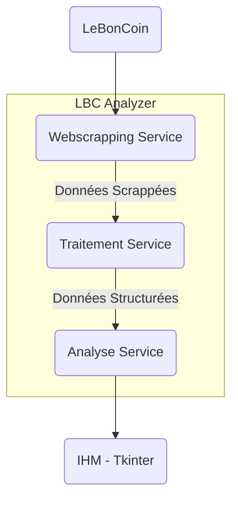

# LBC-Analyzer


<!-- DESCRIPTION -->
## Description
Permet d'analyser de dénicher de bonnes offres sur LeBonCoin.


<!-- GETTING STARTED -->
## Getting Started

### Prerequisites

- Python


### Installation

1. Clone the repo
   ```bash
   git clone https://github.com/Max32x/LBC-Analyzer
   ```

2. Install all the necessary libraries

   ```bash
   pip install -r requirements.txt
   ```
3. Execute the script

   ```sh
   python "main.py" 
   ```


<!-- USAGE EXAMPLES -->
## Usage

Use this space to show useful examples of how a project can be used. Additional screenshots, code examples and demos work well in this space. You may also link to more resources.

_For more examples, please refer to the [Documentation](https://example.com)_

<p align="right">(<a href="#readme-top">back to top</a>)</p>


<!-- ROADMAP -->
## Roadmap

- [x] Add Changelog
- [x] Add back to top links
- [ ] Add Additional Templates w/ Examples
- [ ] Add "components" document to easily copy & paste sections of the readme
- [ ] Multi-language Support
    - [ ] Chinese
    - [ ] Spanish


<p align="right">(<a href="#readme-top">back to top</a>)</p>

<!-- Diagram -->
## Diagram of Architecture



<!-- LICENSE -->
## License

Distributed under the MIT License. See `LICENSE.txt` for more information.

<p align="right">(<a href="#readme-top">back to top</a>)</p>


## Authors and acknowledgment

Developped by Maxime, under the supervision of rag(o)atzino

<p align="right">(<a href="#readme-top">back to top</a>)</p>


<!-- LICENSE -->
## License

Distributed under the MIT License. See `LICENSE.txt` for more information.

<p align="right">(<a href="#readme-top">back to top</a>)</p>


