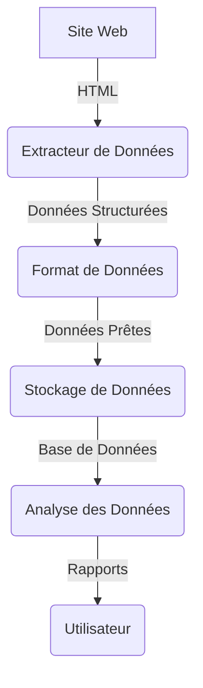

# LBC-Analyzer
Permet d'analyser de dénicher de bonnes offres sur LeBonCoin





<!-- USAGE EXAMPLES -->
## Usage

Use this space to show useful examples of how a project can be used. Additional screenshots, code examples and demos work well in this space. You may also link to more resources.

_For more examples, please refer to the [Documentation](https://example.com)_

<p align="right">(<a href="#readme-top">back to top</a>)</p>


<!-- GETTING STARTED -->
## Getting Started

### Prerequisites

- Python
- GitBash

- A PostGre SQL Database (we used SQLite)
- A Riot API Key (Sans cela, la première ouverture est impossible ; il y aura des messages d'erreurs.)


### Installation
1. Get an API Key at [https://developer.riotgames.com/](https://developer.riotgames.com/) (_Must have an Riot Games account_)


2. Clone the repo
   ```bash
   git clone https://gitlab.com/projet-info-2a-groupe-11/outil-analyse-lol
   ```

3. Install all the necessary libraries

   ```bash
   pip install -r requirements.txt
   ```

4. Enter your API & Database Access in `.env`
   ```js
   API_KEY = RGAPI-e6747bea-8be1-485f-aa91-3da5d892b425

   HOST=sgbd-eleves.domensai.ecole
   PORT=5432
   DATABASE=id2321
   USER=id2321
   PASSWORD=id2321
   ```

5. Execute the script

   ```sh
   python "src\__main__.py" 
   ```


<!-- USAGE EXAMPLES -->
## Usage

Use this space to show useful examples of how a project can be used. Additional screenshots, code examples and demos work well in this space. You may also link to more resources.

_For more examples, please refer to the [Documentation](https://example.com)_

<p align="right">(<a href="#readme-top">back to top</a>)</p>


<!-- ROADMAP -->
## Roadmap

- [x] Add Changelog
- [x] Add back to top links
- [ ] Add Additional Templates w/ Examples
- [ ] Add "components" document to easily copy & paste sections of the readme
- [ ] Multi-language Support
    - [ ] Chinese
    - [ ] Spanish

See the [open issues](https://github.com/othneildrew/Best-README-Template/issues) for a full list of proposed features (and known issues).

<p align="right">(<a href="#readme-top">back to top</a>)</p>


<!-- LICENSE -->
## License

Distributed under the MIT License. See `LICENSE.txt` for more information.

<p align="right">(<a href="#readme-top">back to top</a>)</p>


## Authors and acknowledgment

Developped by Maxime

Under the supervision of 


<!-- LICENSE -->
## License

Distributed under the MIT License. See `LICENSE.txt` for more information.

<p align="right">(<a href="#readme-top">back to top</a>)</p>


